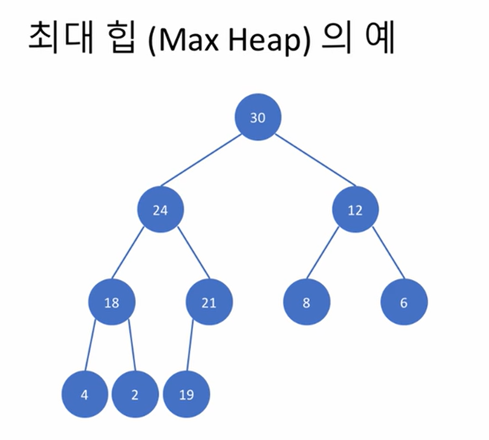

## 강의 정리
### 내용 요약
- 힙 : 이진 트리의 한 종류
    -  루트 노드가 언제나 최대값 또는 최소값을 가짐
        - 최대 힙(Max Heap), 최소 힙(Min Heap)
    - 완전 이진트리여야 한다.

 

 

- 최대 힙의 예
    - 부모 노드는 자식 보다 큰 값을 가져야 한다.
    - 재귀적으로도 정의됨
        - 어느 노드를 루트로 하는 서브트리도 최대 힙이어야 한다.
    - 이진 트리와는 달리 왼쪽 서브트리와 오른쪽 서브트리의 크기는 정의되어 있지 않다.
    - 검색하는데 좋은 방법이 없다.
    - 노드에 번호를 순서대로 매기게 되면 부모 노드와 자식 노드 간에 규칙이 생긴다.
        - 왼쪽 자식 노드의 번호 : 2 * 부모 노드 번호
        - 오른쪽 자식 노드의 번호 : 2 * 부모 노드 번호 + 1
        - 부모 노드의 번호 : 자식 노드 번호 // 2
        - 이러한 특성으로 배열로 힙을 표현할 수 있다.

- 최대 힙에 원소 삽입
    1. 트리의 마지막 자리에 새로운 원소를 임시로 저장
    2. 부모 노드와 키 값을 비교하여 위로, 위로 이동.
  
### 후기
- 