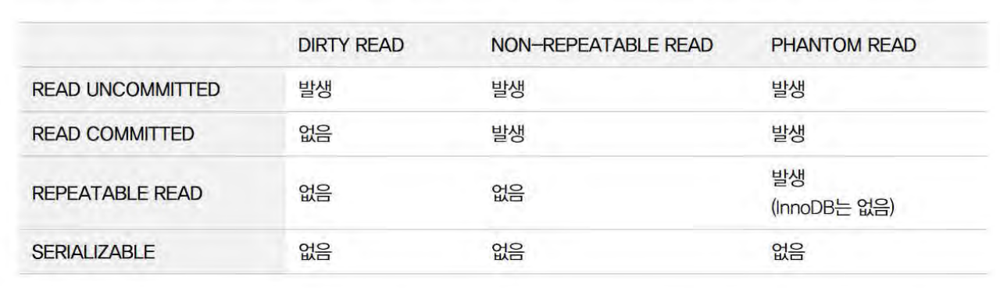

### 행동
- 항상 밝은 표정으로 다니기
- 컴플렉스에 공감하지 않기, 그 단점에 다른 장점을 말해주기
- 긍정 탐구형 말투 : 반대편에 서지 않는 형태로 말하는 방식으로, 반항적인 사람을 대할때 효과적이다. 
    - 부정적인 마음을 가진 사람을 대할땐 상대방을 적극적으로 동의해줘서 본인 스스로가 되돌아 보게 하는 것이 좋다.
- 현재의 힘든일을 지나간 과거를 두고 후회하지말고, 미래의 관점에서 현명하게 대처하기
    - 어바웃 타임이 생각난다. 오랫동안 잊고있었다.

### 집중
- 집중 잘 안될때는 평행 감각과 관련된 스트레칭
- 찬물로 세수 등이 집중을 다시 올려준다
- 딴생각이 떠오르면 메모하자
    - 방해요소가 떠오르면 메모 후 과업을 마친 다음에 종이를 살펴보자.
- 쉬는 시간은 필수다.  
    - 집중에 양은 제한적이기 때문에 타이머를 맞추고 쉬는 시간을 정해두자.
- 타이머를 적극하자
    - 타이머를 이용해서 일정한 간격으로 타이머가 울리도록 한다.
    - 시간은 자신의 주의력이 떨어지는 시간을 보고 결정하면 된다.

### 공부
- 단위 시간당 횟수를 늘리기
- 핵심을 가지고 스토리를 만들듯이 공부하기

### 면접용 암기
#### DB
- 트랜잭션 격리 수준

    - 세가지 이상의 현상을 정의하고 어떤 현상을 허용하는지에 따라서 각각의 `isolation level` 이 구분된다.

### 게으른 완벽주의자를 위한 심리학
#### 자기 인식
 - 자기 인식을 높이는 가장 효과적인 방법은 `일상적으로 하는 행동 하나를 골라, 자신의 행동을 하는 순간을 인식하는 것이다.`
    - `유튜브와 네이버 기사를 보는 순간을 인식해보자`

#### 목표 세우기
- 목표를 구체적으로 정의하려면 다섯 가지 기준을 맞춰야 한다.
    - 구체적일 것(specific)
    - 측정 가능할 것(measurable)
    - 달성 가능한 목표일 것(attainable)
    - 관련성을 지닐 것(relevant)
    - 기한을 정할 것(time-limited)
- 지금 과업을 수행하면 얻을 수 있는 이점을 목록으로 정리해보자.

#### 완벽한 타이밍이란 없다.
 - 완벽한 타이밍이 오리라는 자신을 속이는 행위가 미루기에 일부 기여한다.
    - 아마 지금 당신은 피곤할테다. -> 하지만 내일이 되면 덜 피곤할까?
    - 지금은 그 일이 내키지 않는다. - > 몇시간 후라고 갑자기 동기가 솟구칠까?

#### 성취한 보람에 집중하자.
- 미뤄온 일을 하려면 특히 더 불쾌한 감정이 든다.
- 하지만 과업이 시작하는 불쾌감보다는 끝마쳤을때 느낄 보람에 집중해 보자.
- 마음가짐의 전환은 미루기 극복에 아주 중요하다.

#### 시작은 생각보다 어렵다.
- 제한 시간을 정하자
    - 시간은 각자 원하는 만큼 정해도 되지만 중요한건 몇분이 되었든 간에 시간을 구체적인 시간으로 정한 후 지켜야 한다.
- 딱 5분만 일하는 법
    - 시간 엄수와 관련된 또 다른 접근법으로는 딱 5분만 일하는 방법이 있다.
    - 얼마 되지 않지만 5분이라는 시간 동안 과업을 수행하겠다는 솔직한 결정을 내리고 이후에도 5분 간격으로 과업을 지속할지 순수하게 스스로에게 결정권을 주려는 것이다.